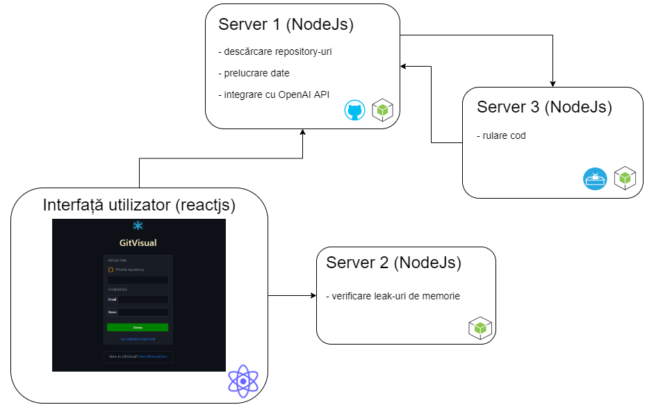

# GitVisual - bachelor degree project

This paper presents a web platform solution for code evolution visualization. The developed platform brings in addition a suite of functionalities, in addition to the one mentioned earlier, which will offer different aspects related to the evolution of the code. First of all, it helps the user to improve the implemented code, as follows: the user has the possibility to automatically identify unusual events in the evolution of a code, can detect if a group of students collaborated to perform a task, check the security of the code, receive certain explanations based on the code written by him (its complexity, some solutions in case of bugs) and to extract certain features that provide information about the contribution of students. It also benefits from a system that evaluates a repository based on contributions.

## Arhitectura sistemului

